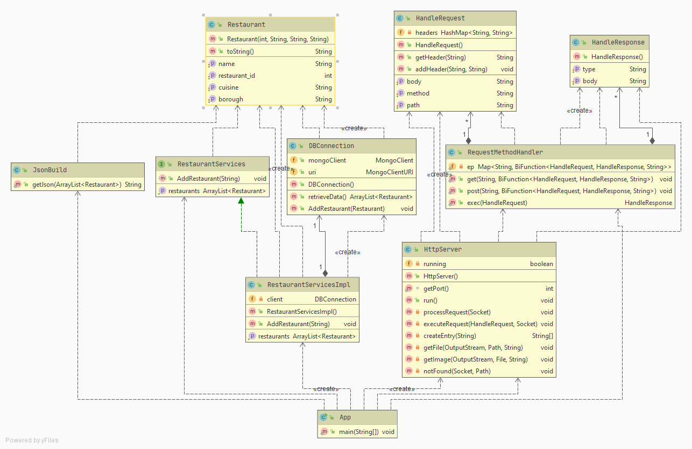

# LAB 3 AREP - Taller Clientes y servicios

## Description

    
  It reads the data from this webpage .
  
  This project has continuos integration via **CircleCi** 
 
## Design 

  This is the intended design for this project
  
  
  
  
  

## User's guide

  This is the guide that will setup this proyect at your local machine in order to be able to run it.
  
  ### Requisites
  
  It is necessary having these tools installed on your computer:
  
  * Maven 
  * Java 
  * Git
 
  ### Setting up
  
1. **Clone this repository:** 

   `git clone https://github.com/JohanS11/Taller1Arep.git`

2. **Build the project with maven:**
  
    `cd LAB2-AREP && mvn package`

3. **Execute the project with maven:**

    `mvn exec:java -Dexec.mainClass="edu.eci.arep.sparkwebapp.SparkWebApp" `
    
    now you can navigate trough your brower at http://localhost:4567/inputdata
    
   ### Architecture Description
   
   You can find the architecture description of this project at [Architecture Description](https://github.com/JohanS11/LAB2-AREP/blob/master/Architecture%20Description.pdf)

   ### Executing tests
   
     In order to run the tests developed with JUnit you have run the follow command:
     
     `mvn test`
     
     ### Tests coverage
     
     
     
  ## This project was built with:
  
   - Apache Maven 3.6.3 
   - Java 1.8.0_211
   - Git 2.26.2
   
  ## POC Heroku App 
  
  
  
  
    
   In case that you try interesting things (;
   
  
  
  ## Java Documentation
  
  In order to get additional information about this project you can use JavaDoc to get the Documentation.
  The documentation of this project is located in this [site](https://johans11.github.io/LAB2-AREP/project-reports.html)
  
  ## Author
  
  Johan Sebastian Arias Amador ([JohanS11](https://github.com/JohanS11))
  
  ## License
  
  This project is licensed under the GNU General Public License v3.0 - see the [LICENSE](https://github.com/JohanS11/LAB2-AREP/blob/master/LICENSE) file for more details.

